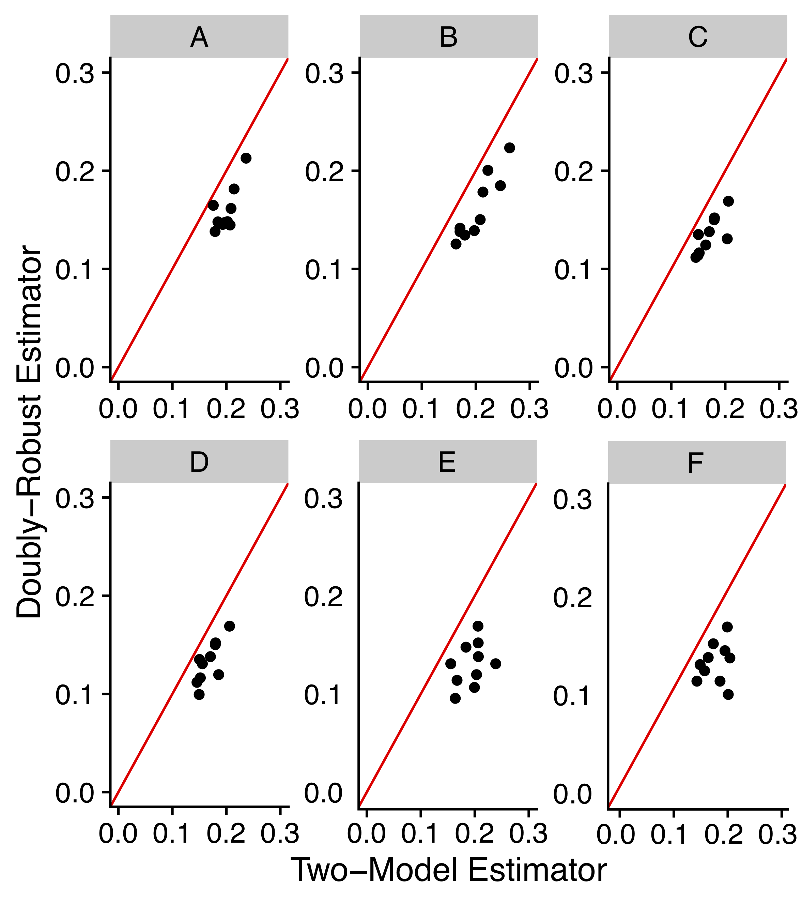

# Abstract of the work:
This is the replication code for the simulation study in the preprint paper "[Group Average Treatment Effects for Observational Studies](https://www.wiwi.hu-berlin.de/de/forschung/irtg/results/discussion-papers/discussion-papers-2017-1/irtg1792dp2019-028-1.pdf)". The simulation compares the two-model approach with our proposed method (doubly-robust estimator extention). We generate different data generating processes and perform a Monte Carlo study to compare the MAE of the treatment effect estimator. 

